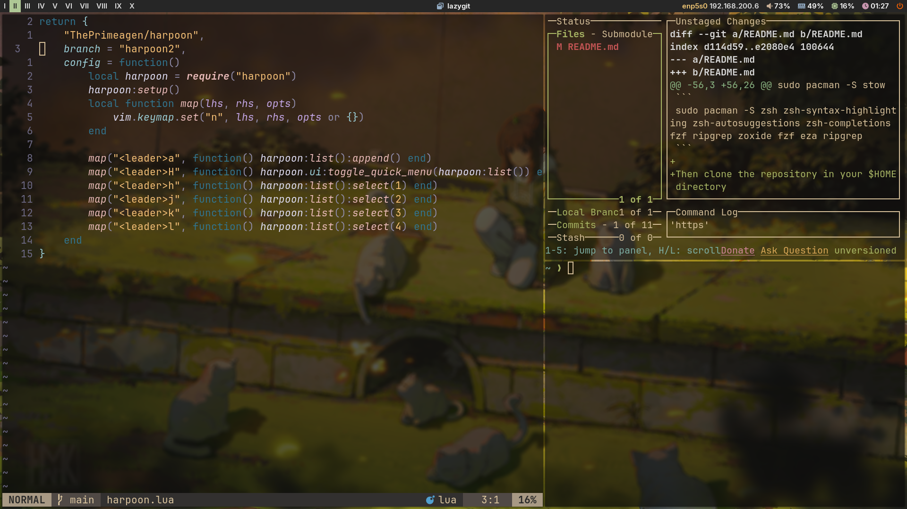

## My personal i3 dotfiles

This repository contains the configuration files for my i3 setup. It is a work in progress and will be updated as I continue to tweak my setup.

# DotFiles Dependencies

- [PowerLevel10K a zsh prompt theme](https://github.com/romkatv/powerlevel10k)
- [Zoxide](https://github.com/ajeetdsouza/zoxide)
- [zsh-autosuggestions](https://github.com/zsh-users/zsh-autosuggestions)
- [zsh-syntax-highlighting](https://github.com/zsh-users/zsh-syntax-highlighting)
- [zsh-completions](https://github.com/zsh-users/zsh-completions)
- [fzf](https://github.com/junegunn/fzf)
- [eza](https://github.com/eza-community/eza)
- [ripgrep](https://github.com/BurntSushi/ripgrep)

# Installation

First Ensure you have the dependencies installed on your system.

## for fedora based distros

### Git

```
sudo dnf install git
```

### Stow

```
sudo dnf install stow
```

### Other dependencies

```
sudo dnf install zsh zsh-syntax-highlighting zsh-autosuggestions zsh-completions fzf ripgrep zoxide fzf eza ripgrep
```

## for archlinux based distros

### Git

```
sudo pacman -S git
```

### Stow

```
sudo pacman -S stow
```

### Other dependencies

```
sudo pacman -S zsh zsh-syntax-highlighting zsh-autosuggestions zsh-completions fzf ripgrep zoxide fzf eza ripgrep
```

Then clone the repository in your $HOME directory

```
git clone https://github.com/gabrielmslima/dotfiles-i3
```

Then cd into the repository and run the following command to symlink the configuration files to your $HOME directory

```
cd dotfiles-i3
stow .
```

If you prefer to install a specific configuration file you can run the following command

```
stow <folder_name>
```

# Screenshots





